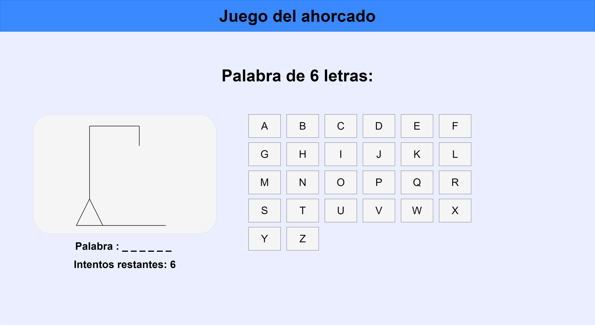
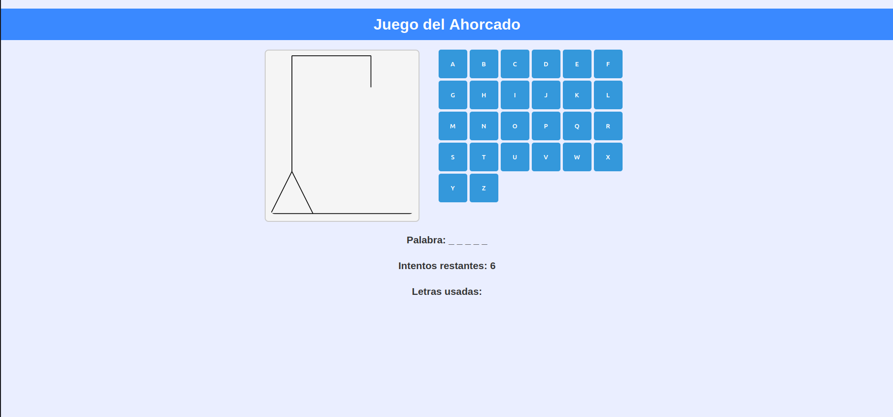

# AhorcadoPHP

AhorcadoPHP es un juego sencillo que te invita a adivinar palabras letra a letra directamente desde el navegador. Está pensado para que cualquier persona pueda jugar sin complicaciones.

---

## Características

- **Interfaz intuitiva**: Página con el tablero del ahorcado y botones para seleccionar letras.
- **Mensajes claros**: Indica si has ganado, perdido o si aún puedes seguir intentando.
- **Reiniciar fácil**: Botón para comenzar una nueva partida sin recargar la página.
- **Palabras aleatorias**: Lista de palabras en un archivo de texto, para partidas diferentes.
- **Compatibilidad con Docker**: Configuración lista para ejecutarse con Docker.

---

## Cómo funciona la partida

1. La página muestra los espacios vacíos de la palabra secreta.
2. Seleccionas letras desde el teclado o los botones en pantalla.
3. Las letras correctas aparecen en su posición.
4. Con cada error, se dibuja una parte del muñeco.
5. Ganas si completas la palabra antes de que se termine el dibujo.
6. Se agotan los intentos y pierdes si no adivinas la palabra a tiempo.

---

## Mockups

| Mockup inicial | Mockup final |
|------------------|--------------|
|  |  |

---

## Cómo ponerlo en marcha

### Opción con Docker

1. Instala **Docker Desktop** y asegúrate de que esté en ejecución.
2. Abre una terminal y navega a la carpeta del proyecto.
3. Ejecuta:  
   ```bash
   docker compose up --build
   ```
4. Cuando aparezca el mensaje de que el servidor está listo, visita:
    http://localhost:8080/ahorcado/index.php
5. Para detener el servidor, presiona Ctrl + C en la terminal.

### Opción sin Docker

1. Copia la carpeta src/public/ahorcado dentro de la carpeta pública de tu servidor local (por ejemplo, C:\xampp\htdocs\ahorcado).
2. Inicia el servidor web (Apache, XAMPP, etc.).
3. Accede en tu navegador a:
    http://localhost/ahorcado/index.php

### Personalización y mantenimiento

* Agregar palabras nuevas: Edita el archivo src/public/ahorcado/words.txt (una palabra por línea).
* Ajustar estilos: Modifica src/public/ahorcado/style.css para cambiar colores, tipografías y diseño.
* Recursos adicionales: Añade imágenes o sonidos en la carpeta recursos.

 ## Notas finales

* Este proyecto es flexible y fácil de extender.
* Para dudas, mejoras o sugerencias, puedes editar este archivo y colaborar en el proyecto.
